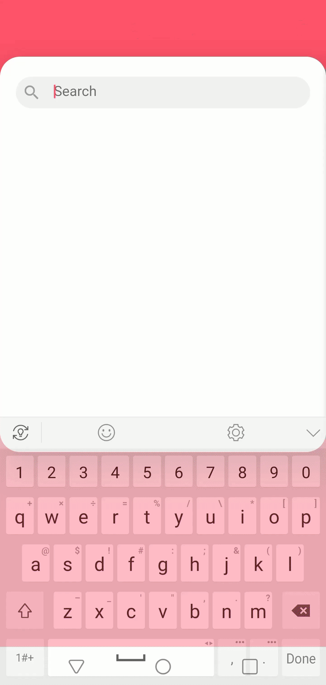
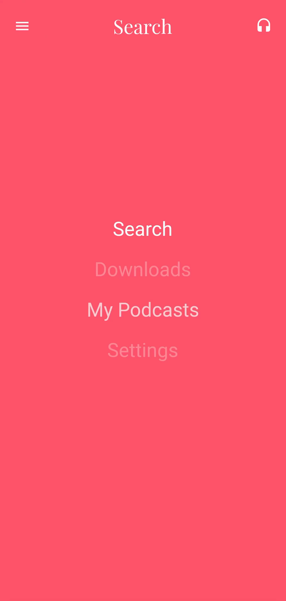

# Podcastronaut
This is a simple podcast player that was based on a UI proof of concept built with Dart & Flutter called .

Initially, it will provide common features included in most podcast apps, including playback, navigation of the audio stream (scrubbing, play/pause, etc.),
querying podcast APIs (beginning with the )), and storing favorites.

## Getting started
### Running
To run this project, clone it using 
```
git clone https://github.com/ttrpd/Podcastronaut.git
```
then open Android Studio and click _**File > Open**_ and select the cloned directory. After opening the project, click _**Run > Run 'Podcastronaut'**_
### Contributing
To start contributing to the project: 
1. pick an issue
2. make a new branch named with the issue number followed by the issue title
3. make commits cataloguing the changes to the code and any associated documentation
4. push the changes
5. open a pull request

## UI Examples
Below are some examples of the UI behavior from the origional project:

Podcast Searching:




Playing an Episode:


Scrubbing through the current episode:


Using the menu:



